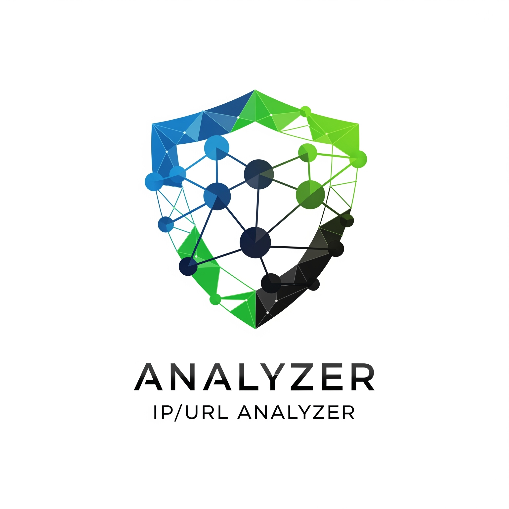

<div align="center">
  
  
  
  
  
  
</div>

<p align="center">
  
</p>

# Analyzer
  
Güvenli Gelecek Burada: Web Sitenizi Her Açıdan Analiz Edin!
Siber saldırılar her geçen gün daha da karmaşıklaşıyor. Analyzer ile web sitenizi ya da kullandığınız cihazları URL veya IP adresleri üzerinden derinlemesine analiz ederek hem saldırı vektörlerini tespit edebilir hem de savunma mekanizmalarınızı güçlendirebilirsiniz. Geleceğin siber güvenlik ihtiyaçlarına bugünden hazırlanın!

---

## Features / *Özellikler*

  *URL'den IP Çözümleme: Bu özellik, girilen bir URL adresinin arkasındaki IP adresini hızlıca tespit etmenizi sağlar. Bu sayede, bir web sitesinin barındırıldığı sunucunun IP'sine ulaşarak daha ileri analizler için başlangıç noktası elde edebilirsiniz.*

  *WHOIS Sorgusu Yapma: WHOIS sorgusu, bir alan adının kime ait olduğunu, kayıt tarihini, bitiş tarihini ve DNS sunucularını gibi bilgileri öğrenmenizi sağlar. Bu özellik, özellikle bir alan adının sahibini veya iletişim bilgilerini tespit etmek istediğinizde oldukça faydalıdır.*
  
  *NMAP ile Port ve İşletim Sistemi Taraması Yapma: NMAP entegrasyonu sayesinde, hedef sistemlerde açık olan portları ve çalışan işletim sistemini tespit edebilirsiniz. Bu, potansiyel güvenlik açıklarını belirlemek ve hedef hakkında bilgi toplamak için kritik bir adımdır.*
  
  *NIKTO ile Web Uygulama Güvenlik Taraması Yapma:NIKTO, web sunucularında ve web uygulamalarında bilinen güvenlik açıklarını, yanlış yapılandırmaları ve potansiyel zafiyetleri taramak için kullanılır. Bu özellik, web uygulamalarınızın güvenliğini artırmak için önemli bir araçtır.*
  
  *GOBUSTER ile Web Uygulama Güvenlik Taraması Yapma:GOBUSTER, bir web sitesindeki gizli dizinleri ve dosyaları (brute-force yöntemiyle) keşfetmek için kullanılır. Bu sayede, geliştiriciler tarafından unutulmuş veya erişim denetimi zayıf olan alanları tespit ederek olası sızma noktalarını belirleyebilirsiniz.*
  
  *WPSCAN ile WordPress Güvenlik Taraması Yapma: WPSCAN, özellikle WordPress tabanlı web siteleri için geliştirilmiş bir güvenlik tarama aracıdır. WordPress eklentilerindeki, temalarındaki ve çekirdek yazılımındaki bilinen zafiyetleri tespit etmenizi sağlar.*
  
  *SSL/TLS Güvenlik Taraması Yapma: Bu özellik, bir web sitesinin kullandığı SSL/TLS sertifikasının geçerliliğini, gücünü ve olası yapılandırma zafiyetlerini kontrol eder. Güvenli iletişim için kritik olan bu tarama, şifreleme kalitesini değerlendirmenize yardımcı olur.*
  
  *Risk Tespiti Gerçekleştirme: Yazılımınızın topladığı tüm verileri analiz ederek, tespit edilen zafiyetlerin ve yanlış yapılandırmaların potansiyel risk seviyelerini belirler. Bu, güvenlik açıkları arasında önceliklendirme yapmanızı sağlar.*
  
  *Saldırı ve Savunma Yöntemleri Önerileri Sunma: Tespit edilen risklere ve zafiyetlere dayanarak, bunlardan faydalanmak için hem saldırı senaryolarını hem de gidermek için önerilen savunma mekanizmalarını sunar. Bu, kullanıcıların güvenlik duruşlarını iyileştirmelerine yardımcı olan pratik rehberlik sağlar.*
  
  *Risk Skoru Verme: Son olarak, yazılımınız tespit edilen güvenlik açıklarının ciddiyetine göre bir risk skoru atar. Bu skor, genel güvenlik seviyesini özetleyerek kullanıcıların mevcut durumlarını hızlıca anlamalarını ve gerekli aksiyonları almalarını kolaylaştırır.*
  
---

## Team / *Ekip*

- 2420191006 - Raşit ÇANKAYA - Proje Sorumlusu
- 2420191042 - Muhsin Murat Yaşar - Proje Sorumlusu 

---

## Roadmap / *Yol Haritası*

See our plans in [ROADMAP.md](ROADMAP.md).  
*Yolculuğu görmek için [ROADMAP.md](ROADMAP.md) dosyasına göz atın.*

---

## Research / *Araştırmalar*

| Topic / *Başlık*        | Link                                    | Description / *Açıklama*                        |
|-------------------------|-----------------------------------------|------------------------------------------------|
| NMAP Paketi Analiz      | [researchs/nmap.md](researchs/nmap.md) | In-depth analysis of NMAP suite. / *NMAP paketinin derinlemesine analizi.* |
| Example Research Topic  | [researchs/nmapozet.md](researchs/nmapozet.md) | Brief overview of this research. / *Bu araştırmanın kısa bir özeti.* |

---

## Installation / *Kurulum*

1. **Clone the Repository / *Depoyu Klonlayın***:  
   ```bash
   git clone https://github.com/c4nka/analyzerfinalproject.git
   cd analyzerfinalproject
   ```

2. **Set Up Virtual Environment / *Sanal Ortam Kurulumu*** (Recommended):  
   ```bash
   python -m venv venv
   source venv/bin/activate  # On Windows: venv\Scripts\activate
   ```

3. **Install Dependencies / *Bağımlılıkları Yükleyin***:  
   ```bash
   pip install -r requirements.txt
   sudo apt update
   sudo apt install nmap
   sudo apt install nikto
   sudo apt install gobuster
   sudo gem install wpscan
   sudo apt install sslscan
   sudo apt install whois
   sudo apt install arp-scan
   pip install reportlab mac-vendor-lookup idna
   sudo apt install sqlmap *optional*
   ```

---

## Usage / *Kullanım*

Run the project:  
*Projeyi çalıştırın:*

```bash
cd /DosyaKonumu
cd /Dosya
python analyzer.py
```

**Steps**:  
1. Prepare input data (*explain data needed*).  
2. Run the script with arguments (*explain key arguments*).  
3. Check output (*explain where to find results*).  

*Adımlar*:  
1. Giriş verilerini hazırlayın (*ne tür verilere ihtiyaç duyulduğunu açıklayın*).  
2. Betiği argümanlarla çalıştırın (*önemli argümanları açıklayın*).  
3. Çıktıyı kontrol edin (*sonuçları nerede bulacağınızı açıklayın*).

---

## Contributing / *Katkıda Bulunma*

We welcome contributions! To help:  
1. Fork the repository.  
2. Clone your fork (`git clone git@github.com:YOUR_USERNAME/YOUR_REPO.git`).  
3. Create a branch (`git checkout -b feature/your-feature`).  
4. Commit changes with clear messages.  
5. Push to your fork (`git push origin feature/your-feature`).  
6. Open a Pull Request.  

Follow our coding standards (see [CONTRIBUTING.md](CONTRIBUTING.md)).  

*Topluluk katkilerini memnuniyetle karşılıyoruz! Katkıda bulunmak için yukarıdaki adımları izleyin ve kodlama standartlarımıza uyun.*

---

## License / *Lisans*

Licensed under the [MIT License](LICENSE).  
*MIT Lisansı altında lisanslanmıştır.*

---

## Acknowledgements / *Teşekkürler* (Optional)

Thanks to:  
- Keyvan Arasteh Abbasabad (keyvan.arasteh@istinye.edu.tr)
- İstinye Üniversitesi 

---

## Contact / *İletişim* (Optional)

*Proje Sorumluları: Raşit Çankaya & Muhsin Murat Yasar - 2420191006@stu.istinye.edu.tr & 2420191042@stu.istinye.edu.tr - Hata bulursanız bir sorun bildirin.*

---

*Replace placeholders (e.g., c4nka/analyzerfinalproject) with your project details.*
